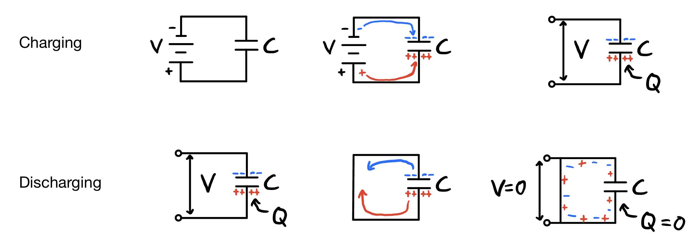
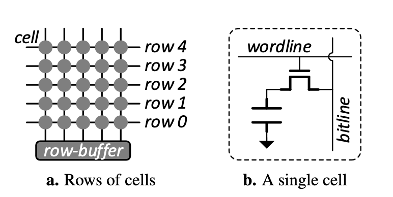
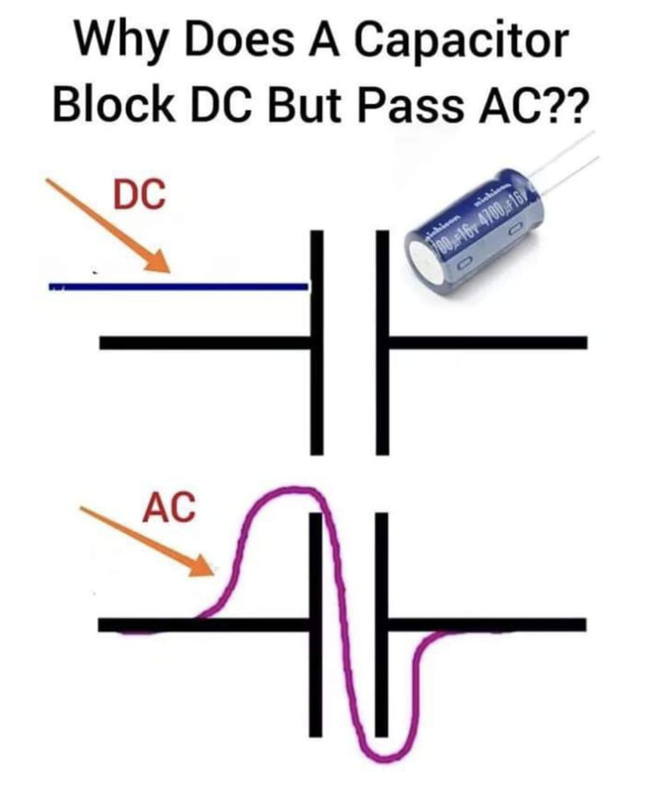

# The row hammer exploit

Author: James Commons

Date: November 13, 2024

For the most part, computer scientists treat the computer as an abstraction.
If you give a computer arbitrary code, we assume that it will execute the
instructions faithfully, exactly as we specified. Any error in execution is
typically attributed to an error in what we asked it to do. However, this view
is divorced from the reality that computers are physical devices, which don't 
always perform exactly as we would like them to.

For example, if we want to write a byte to memory, we expect that the operation 
will only affect the *physical address* we are actually writing to, and that it
will place the bits we told it to copy in the place we told it to put them.
This is almost always the case — computers are remarkably reliable after all.
Nevertheless, errors can occur. You may have heard that cosmic rays from 
solar storms can wreak havoc on computer systems, and this is because these 
rays carry enough energy to meaningfully interact with computer memory, 
potentially flipping a bit. Depending on what information that bit carried, this
can either go completely unnoticed, or completely crash your computer. Luckily,
the vast majority of the bits stored in your computer's memory is data, not 
executable code, so these random events are far more likely to slightly alter 
the brightness value of a single pixel on your screen than cause any real issues. 

But what if we had a little bit more control over where these random bit flips
occur? As you will see, just this little bit of control is enough for an
attacker to potentially gain a foothold on your machine. It turns out that
due to the incredible density of modern memory, it is possible to write a program 
that not only affects the address is requests to read from or write to, but also 
neighboring memory cells on the physical chip. The exploit is called row hammer,
and despite being discovered in 2014, the attack is still relevant today. To 
understand how it works, we need a basic understanding what computer memory
actually is and how it works.

## How computer memory works

### The capacitor

Storing a single bit can be accomplished in several ways. For example, inside the 
CPU, data is stored in registers, which store bits in circuits called S-R latches.
You can think of these latches like toggle switches. You can send a signal to either
turn them off or on, representing either a 0 or 1. These circuits are fast, but they
take up a lot of space in the CPU, thus they are not well suited for high capacity.
Therefore, computer memory takes a different approach: it stores data in an electrical
device called a capacitor. At a high level, one can think of a capacitor like a battery
that can store and discharge electric charge. We can use a capacitor to store a bit
of data by either filling it with charge or leaving it depleted. Indeed, this is 
exactly what computer memory actually does. This approach has the benefit of being
easily scalable and very dense, which ultimately means more memory capacity.

In reality, a capacitor is a very different device from a battery. To understand
the inner workings of a capacitor, one would have to take a class in electronics or
physics, but I will try to explain the basics here. 



The diagrams above describe simple circuits that charge and discharge a capacitor with 
capacitance $C$. To charge a capacitor, one needs to apply a voltage across its plates,
which we can think of as connecting the capacitor to a battery. When we do this, negative 
charges will flow to the top plate of the capacitor and positive charges will flow to
the bottom plate. The total charge $Q$ on the bottom plate is given by $Q = CV$. This means 
that the amount of charge a capacitor can hold can vary depending on the voltage applied. 
Since we are trying to store digital data, we just need enough charge to sufficiently 
distinguish between a charged state and a depleted state. A cool fact about capacitors is 
that if we remove the battery from the circuit, the capacitor will actually hold it's 
charge indefinitely. This is why it is useful in computer memory.

To discharge the capacitor, we simply need to reconnect the two plates by completing the
circuit *without* the battery in place. This will allow the positive and negative charges
which are attracted to each other to flow towards regions of opposite charge until they
are evenly dispersed across the circuit. This results in the net charge $Q$ on the bottom 
plate to be 0. 

I propose the following procedure for storing a bit of data. If we wish to store a 1, we 
apply a voltage across the capacitor and then electrically isolate it from the rest of the
device, allowing it to retain its charge. If we wish to store a 0, we reconnect the capacitor
to the rest of the device and allow it to discharge any charge it had stored. We have just 
created a single bit of memory.

### DRAM composition

Dynamic random access memory (DRAM) is, at its core, billions of these capacitors laid
out in two-dimensional arrays known as banks. Below is a figure from the original 
row hammer paper describing the layout of DRAM \[1\].



Each bit is stored in a cell, which consists of a single capacitor and a transistor
(essentially a tiny switch). Each cell is connected to two wires, the wordline and
the bitline. As shown, each wordline controls a particular row of cells, and each
bitline is connected to a column of cells. When the wordline is active, it switches on all 
of the transistors in a row, connecting all the capacitors to a larger circuit. This is 
essentially the same thing as discharging the capacitors. Any charge originally stored on a 
capacitor is sent down the bitline when a cell is connected to an active wordline. When the 
wordline is inactive, this turns off the transistor, electrically isolating the capacitor 
and allowing it to store charge. The final component is the row buffer,
which can store an entire row of binary data using something other than just a single
capacitor (possibly an S-R latch similar to a CPU register). Each bit in the row
buffer is connected to its respective column's bitline \[1\]. 

It is now finally time to discuss how computers really read and write to memory.
Suppose you want to read a single byte in row 3. We don't have enough control to just
grab that one byte directly from the cells in memory. Instead, we have to first 
transfer an entire row into the row buffer, where we have more granular control. We do 
this by outputting a "high" voltage on wordline 3. This allows any charge stored on
the capacitors in row 3 to discharge through their respective bitlines. In the process,
the voltage on each bitline will momentarily be either "high" or "low" corresponding to 
whether there was charge stored in a cell or not. The row buffer bits latch onto their
respective bitline's voltage. This operation transfers the state of row 3 into the row
buffer, but it has also destroys all the data in row 3 since all the capacitors are 
allowed to discharge. Once the information is in the row buffer, the memory controller
will fetch the desired byte from the row buffer, completing the read operation. It now
has to put the data in the row buffer back into row 3. It does this by applying a voltage
to bitlines that correspond to a 1, charging up the capacitor connected to that bitline.
Finally, the wordline will become inactive, switching off all transistors in row 3 and
disconnecting the capacitors, allowing them to retain their charge and store data. To write
to memory, the same operation occurs, only the data in the row buffer is first modified 
to reflect the desired change before transferring data back to a row \[1\].

Now there is one more complication I need to address. Remember how I said a capacitor will 
hold its charge indefinitely? Well I lied, it won't. This is due to leakage caused by
the transistor. Several mechanisms are at play, including quantum tunneling, but the net
effect is that the cells in DRAM will slowly lose their charge through their transistors, 
even when the wordline is not active. For the standard DDR3 (relevant at the time the row
hammer paper was written), the cells are guaranteed to hold their charge for 64 
milliseconds \[1\]. After that, a cell's state is ambiguous. So, we need a way to periodically
refresh rows in a bank. We actually already have a process that does exactly that. All we
need to do is periodically read from a row (although we don't actually need to do anything
with the data). The act of discharging and recharging the capacitors is a sufficient enough
to mitigate this complication. As long as we refresh a row at least every 64 milliseconds,
we can be reasonably sure that no data is lost. By the way, this refresh process is what
makes DRAM dynamic. Other types of memory, such as static random access memory, do not 
have this same problem.

## Disturbance errors

A disturbance error refers to an unwanted interaction between two unrelated circuit 
components in memory which can lead to flipped bits \[1\]. There are many mechanisms for
disturbance errors, but fundamentally, they are all possible due to the close physical
proximity of circuit elements in DRAM. One possible explanation is called capacitive 
coupling. It turns out we can actually treat two adjacent wires as one capacitor. The
capacitance $C$ depends on the both the length of the two wires and the distance separating
them in a complicated way, but in general, $C$ increases as the distance decreases. Now,
something about capacitors that I haven't mentioned yet is that they can actually transmit
voltage across the two plates — but only if that voltage varies with time. In other words,
when a capacitor is placed along a wire, the voltage on one end of the wire will reach the
other end of the wire if the voltage varies fast enough with time. The frequency at which
this happens is known as the cutoff frequency. This frequency is inversely proportional to
$C$, meaning that a higher capacitance makes it easier to transmit voltage through a 
capacitor (we don't have to switch the voltage on and off as quickly if the capacitance
is high enough).



*This is not even remotely accurate but it's a funny meme. Credit: Facebook user Physics 4 u.*

The extreme density of DRAM chips means adjacent wordlines experience relatively high capacitive
coupling. Put this together with the fact that memory operates at very high frequencies (on the 
order of GHz) and we have just the right conditions for wordlines to influence each other, even 
though they theoretically should be completely independent. Let's look at an example to show
how these disturbance errors could flip bits. Suppose we have a program that needs to read data
in row 3 very frequently. This would mean that the row 3 wordline switches on and off
a lot in a short amount of time. Since the voltage on the row 3 wordline is switching at high
frequencies, some of this voltage ends up powering adjacent wordlines, which partially turns on
the transistors in rows 2 and 4. This causes the capacitors in rows 2 and 4 to experience abnormally
high leakage currents, resulting in faster discharge times. In this scenario, it is possible that 
some cells will loose enough charge within the refresh window of 64 milliseconds to flip from a 1
to a 0. Thus, repeatedly accessing a particular row in memory can cause bits to flip in adjacent 
rows.

### Inducing disturbance errors programmatically

Suppose that a byte at address $X$ resides physically in row 2 of a particular bank in DRAM. If we 
wanted to flip bits in adjacent rows, we would have to repeatedly read from address $X$. We can write
a very simple program in assembly that does this \[2\]:

```asm
rowhammer:
  mov (X), %rax  ; read memory at address X into the %rax register
  clflush (X)    ; flush the cache associated with the address X
  jmp rowhammer
```

The `clflush` instruction is necessary because if the CPU notices that a program is accessing the
same memory over and over again, it's just going to store that data in one of its caches to 
improve performance. The `clflush` instruction tells the CPU to dump the cached data associated
with address $X$. This guarantees that we are always reading from the vulnerable DRAM chip.

Unfortunately, the process is not quite this easy. In order to increase performance, the 
memory controller won't transfer data from a row buffer back into row unless another row in
the same bank needs to be accessed. So, when we run the code above, the memory controller will
transfer the data in row 2 into the row buffer, and then each read operation will read directly
from the row buffer. This means that the row 2 wordline is only actually toggled once, even 
though we repeatedly read from data stored in that row \[1\]. To force multiple wordline 
activations, we need to open another row *in the same bank*. Let's suppose that the byte at 
address $Y$ physically lives in row 4. We can then run the following code:

```asm
rowhammer2:
  mov (X), %rax  ; read memory at address X into the %rax register
  mov (Y), %rbx  ; read memory at address y into the %rbx register
  clflush (X)    ; flush the cache associated with the address X
  clflush (Y)    ; flush the cache associated with the address Y
  jmp rowhammer2
```

This code will induce disturbance errors. This is because $X$ and $Y$ live in different rows
in the same bank, so repeatedly accessing them one after the other forces the memory controller
to continually toggle specific wordlines.

## How can we exploit disturbance errors?

So, we now have a way of programmatically flipping bits in memory that the attacking program
is not supposed to have access to. Turning this ability into a useful exploit is really hard.
First, we need some way of knowing what addresses live in particular banks and rows. Second, 
we need a way to convert the random bit flips that occur in a targeted row into predictable 
results that we can exploit. The approach I will go over originated in 2015 at a Black Hat
conference. I suggest looking at Ref. \[2\] and its associated 
[white paper](
https://www.blackhat.com/docs/us-15/materials/us-15-Seaborn-Exploiting-The-DRAM-Rowhammer-Bug-To-Gain-Kernel-Privileges-wp.pdf) 
for more information about this exploit.

Solving the first problem can be achieved a couple of different ways,
but my favorite is just to guess and check. A typical DDR3 rank will have 8 banks (although a
module might have more than one rank, and computers often have more than one module) \[1\]. 
This means that if we row hammer addresses at random, we will eventually find two addresses
in the same bank \[2\]. But how do we know that we successfully flipped bits? The first thing we
can do is look directly for bit flips in memory. If we know what the data was supposed 
to be before we row hammered, we can look for discrepancies after the fact. This process requires
us to allocate a huge chunk of data to our address mapping program. Otherwise, we would not be
able to read the memory that we are trying to test because it would not belong to the program. The 
other thing we can do is look at how long it takes the computer to read from two different 
addresses \[2\]. If two addresses live in the same bank, then accessing their data back-to-back 
will take longer than if they were in different banks. This is because data that lives in different
banks can be served by two separate row buffers and reading is closer to a parallel operation. If the
data lives in the same bank, the memory controller has to transfer both rows into the row
buffer *sequentially*, resulting in slower read times.

Once we have found two virtual addresses that map to physical addresses in the same bank, we 
need to populate memory around those addresses with data structures that would be advantageous
to an attacker should their bits flip. One such data structure is called a page table entry (PTE).
A PTE is a data structure that helps the computer resolve virtual addresses to physical addresses 
\[2\]. They contain a physical address to redirect to. This is what we will target in our exploit. 
I will skip over the details of how this works, but we can in principle cover a majority of
physical memory with PTEs by repeatedly mapping the same file using the `mmap()` system call. 
Once we do this, we row hammer the vulnerable addresses we found before, hopefully flipping bits.
Since most of memory is just PTEs, there is a high probability that one of the bit flips that occurs
will alter the physical address a PTE maps to. Furthermore, since memory is filled with PTEs, it is 
likely that the random bit flip causes the PTE to point to *another PTE*. Once the program is allowed
to edit the address in a PTE associated with the program, it is game over. We have access to all of
physical memory.

In practice there are many complications. For example, we need to be lucky enough for one of the 
random bit flips to alter the read-write bit in the PTE we are targeting. Also, forcing the OS
to actually behave how we think it's going to behave (by spraying all of physical memory with 
PTEs) is a lot harder to do in practice, and involves kernel level knowledge. Needless to say,
exploiting row hammer is an expensive ordeal that requires talented low level programmers with 
intimate knowledge of the inner workings of both memory and the operating system. Fundamentally,
this is why we don't see row hammer exploits all that often. Also, row hammer provides a route
for privilege escalation, but as far as we know, it is not useful for gaining an initial foothold 
into a network or computer. At one point however, there was a bug in Google Chrome that allowed 
JavaScript to row hammer a machine \[2\]. This was fixed by disabling the `clflush` instruction 
that makes row hammer possible in the first place. 

## Mitigation

How do we fix this issue? Since row hammer is a hardware bug, no software fix will completely 
mitigate it (although we can make it more challenging to exploit). A true fix needs to be 
implemented at the hardware level. One such approach has existed in the server space for a while:
error-correcting-code (ECC) memory. ECC memory dedicates a portion of its usable capacity solely
to redundancy bits that can be used to identify and correct errors in memory. ECC memory comes with
a performance overhead, and the memory is generally more expensive than typical modules used by home
computers. Additionally, while ECC memory can correct 1 or even 2 bit errors, but it cannot correct
3 or more errors. Using row hammer, it is possible to induce more than 2 errors, meaning this fix
is not ideal.

Another fix proposed in Ref. \[1\] is to refresh adjacent rows after reading from a specific row
in memory. However, we wouldn't refresh every single time we read from memory since this would
result in significant performance hits. Instead, everytime we read from a row, there is some low
probability that the adjacent rows will get refreshed. This means that if we read from a row a 
bunch of times, it is statistically likely that we refresh vulnerable rows, eliminating the risk
that repeatedly reading from a particular row will flip bits in neighboring cells. This approach 
is called probabilistic adjacent row activation (PARA).

There are many more proposed solutions, including a suite of target row refresh (TRR) schemes that
more or less do the same thing as PARA (but are implemented much differently) \[3\]. However, none
of these solutions get to the root of the problem, which is that the increased density of DRAM
necessarily leads to electromagnetic interference between circuit elements. As memory capacities
continue to increase, a more radical change in design may be necessary to prevent attacks like 
row hammer.

## References

- \[1\] Y. Kim, R. Daly, J. Kim, C. Fallin, J. H. Lee, D. Lee, C. Wilkerson, K. Lai, and 
O. Mutlu, Flipping bits in memory without accessing them: an experimental study of DRAM 
disturbance errors, SIGARCH Comput. Archit. News **42**, 361 (2014).
- \[2\] M. Seaborn and T. Dullien, Exploiting the DRAM rowhammer bug to gain kernel 
privileges,
https://www.blackhat.com/docs/us-15/materials/us-15-Seaborn-Exploiting-The-DRAM-Rowhammer-Bug-To-Gain-Kernel-Privileges.pdf,
(accessed Nov. 2024).
- \[3\] Y. Jiang, H. Zhu, H. Shan, X. Guo, X. Zhang, and Y. Jin, TRRScope: *Understanding 
Target Row Refresh Mechanism for Modern DDR Protection*, in 2021 *IEEE International Symposium 
on Hardware Oriented Security and Trust (HOST)* (IEEE, Tysons Corner, VA, USA, 2021), pp. 239–247.
